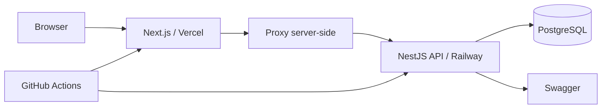
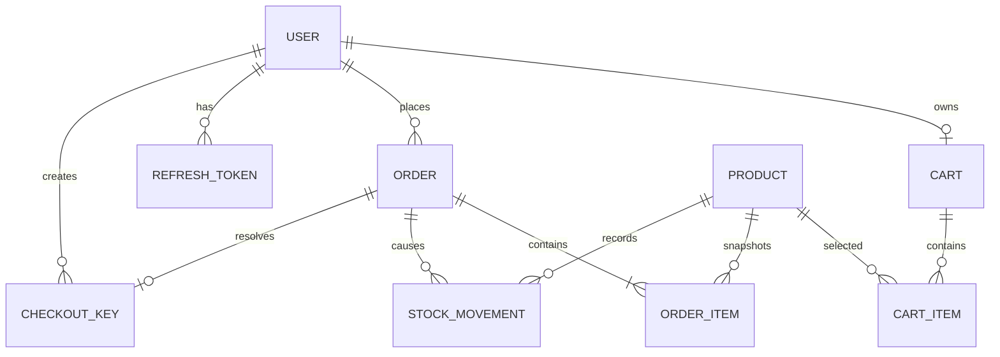

# Arquitetura do OrderFlow

## Visão geral



## Divisão do backend

Cada módulo reúne apresentação, aplicação, regras e persistência sem colocar regra de negócio nos controllers.

- **Controllers:** recebem HTTP, validam DTOs e chamam serviços;
- **Services:** executam regras de negócio e transações;
- **Prisma:** implementa persistência relacional;
- **Guards:** autenticação, CSRF e autorização;
- **Filters:** normalização global de exceções;
- **DTOs:** contrato e validação de entrada.

## Autenticação

```mermaid
sequenceDiagram
  participant B as Navegador
  participant W as Next.js Proxy
  participant A as API
  participant D as PostgreSQL
  B->>W: POST /api/proxy/auth/login
  W->>A: POST /auth/login
  A->>D: valida usuário e senha Argon2id
  A->>D: salva hash do refresh token
  A-->>W: Set-Cookie access + refresh; csrfToken
  W-->>B: cookies HttpOnly no domínio do frontend
  B->>W: Requisição autenticada + X-CSRF-Token
  W->>A: cookies + cabeçalho CSRF
  A-->>B: resposta
```

O access token possui curta duração. O refresh token é rotacionado, salvo apenas como hash e associado a uma família de sessão. A apresentação de um refresh token já revogado encerra a família inteira.

## Modelo relacional



## Checkout concorrente

A operação usa isolamento `Serializable` e atualização condicional:

```sql
UPDATE "Product"
SET "stock" = "stock" - :quantity
WHERE "id" = :productId
  AND "active" = true
  AND "deletedAt" IS NULL
  AND "stock" >= :quantity;
```

Se nenhuma linha for atualizada, uma exceção de falta de estoque provoca rollback. Há nova tentativa automática para conflito serializável e uma restrição `CHECK` no banco impede saldo negativo.
